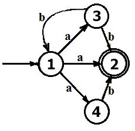

# Autómatas finitos no determinísticos

## Link a las diapositivas de la clase

[Diapositivas](https://docs.google.com/presentation/d/1HLZkuw_BLXJ-MVTC7Bg9Up-xpzZQ8is90FVlNWATdhM/edit#slide=id.p)

## Link al video con la explicación

[Video de youtube](https://youtu.be/HmpzslJozJM)

## Enunciado

Queremos resolver mediante un AFN [este ejemplo](https://er.yuvayana.org/nfa-nondeterministic-finite-automata-definition-example-application/)

M = ({1, 2, 3, 4}, {a, b}, δ, 1, {2}), donde δ es definido como

- δ (1, a) = 2,
- δ (1, a) = 3,
- δ (1, a) = 4,
- δ (3, b) = 1,
- δ (3, b) = 2,
- δ (4, b) = 2.

## Por qué resolver un AFN (_NFA_) es interesante en Prolog

Porque en un [autómata finito no-determinístico](https://es.wikipedia.org/wiki/Aut%C3%B3mata_finito_no_determinista)

- dado un estado podría haber múltiples transiciones posibles (y todas válidas).
- cada estado siguiente puede elegirse al azar y en paralelo.
- y eso determina que la palabra puede parsear ok por más de un camino.
